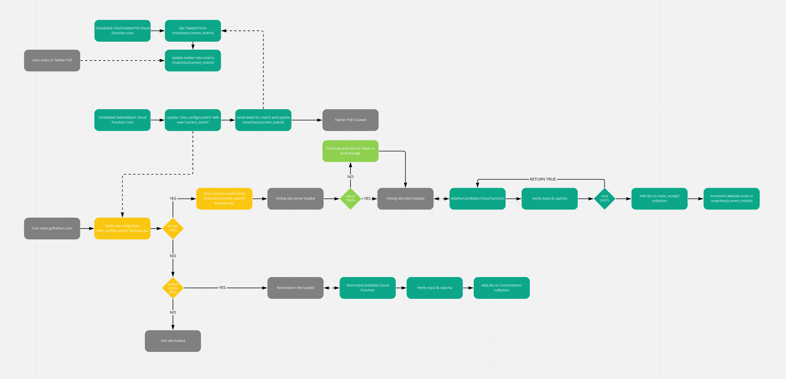

# Griftathon 2022

GRIFTATHON was an annual poll held to find the greatest grifter in the US/China policy space. It started as a Twitter poll in 2020, but since I missed 2021's GIRFTATHON I wanted to make 2022's a fully fledged event with a custom web app and open nominations.

Once voting started the web app would tally up votes made directly there and any votes on a scheduled Twitter poll that would run at the same time. Once voting for that round was over it would save the results to Firebase Firestore, and automatically start the next round of voting.

This web app has been tested and as of October 2022 worked, however with a set of [unforseen](https://www.nytimes.com/2022/10/27/technology/elon-musk-twitter-deal-complete.html) [changes](https://www.cnn.com/2022/12/22/tech/twitter-layoffs-continue/index.html) [to Twitter](https://www.vice.com/en/article/ake44z/elon-musk-vladimir-putin-ukraine) [policy](https://www.theverge.com/2022/11/4/23441404/twitter-trust-safety-staff-layoffs-content-moderation), I ended up deactivating my accounts and shelving this project. Please feel free to use any elements of this or run your own poll web app with the code provided and feel free to hit me up at [@digglesby@mastodon.sdf.org](https://mastodon.sdf.org/@digglesby) if you do anything cool with this!

## Design Overview

[View in Miro](https://miro.com/app/board/uXjVPYHSato=/?share_link_id=346136731232)

The application uses Next.js in static mode and Firebase hosting to serve the front end.

The application uses Firebase cloud functions to serve the four backend cloud functions

| Title            | Runs            | Description                                                                                          |
|------------------|-----------------|------------------------------------------------------------------------------------------------------|
| checkTwitterPoll | Every 5 minutes | Updates /match/{current_match} in Firestore with the new Twitter poll results                        |
| switchMatch      | Every 2 days    | Saves the match results to /site_config/current and creates the new match entry                      |
| submitNomination | On HTTP Call    | Adds a user submitted nomination to /nominations collection in Firestore                             |
| vote             | On HTTP Call    | Adds an entry to the /vote_receipt collection and adds a vote to the /match/{current_match} document |

